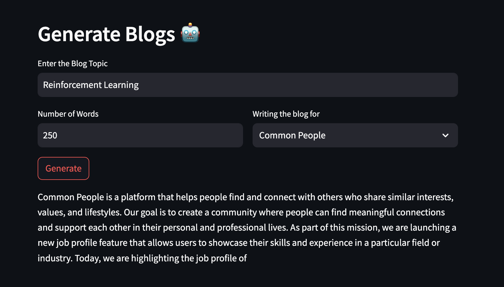

# llama2-blog-generation
Blog Generation with llama2

Using transformers with langchain is very straightforward

Would be cool to use ollama, but ollama is pretty limited on models. Especially compared to HF

Definitely can add this functionality to Blawgsum. But would want to make it RAG supported
and possibly work with an outline if possible

